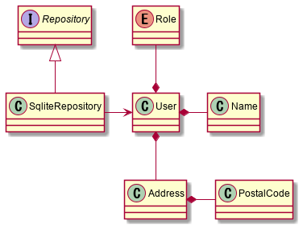
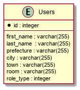

# エンティティの実装

---

## 構成

- 自己紹介
- エンティティとは
- エンティティの実装
- ドメインモデル
- データモデル
- 適用パターン
- まとめ

---

## 自己紹介

- カキギカツユキ
- ネット通販の会社で業務システムを開発運用しています
- あと、売掛金・買掛金管理の管理業務しています
- その前はシステムエンジニアとしていろんな会社のシステム開発をしていました

---

## エンティティとは

> 多くのオブジェクトは、本質的に、その属性によってではなく、連続性と同一性(identity)によって定義される。
>
> エリック・エヴァンスのドメイン駆動設計

> ドメインの概念をエンティティとして設計するのは、その同一性を気にかけるときだ。つまり、システム内の他のオブジェクトと区部が必須の制約となっている時である。エンティティは一意なものであり、長期にわたって変わり続けることができる。変わりかたはさまざまなので、オブジェクトが、かつてあった状態からまったく変わってしまうこともあるだろう。しかし、見た目が変わっても、それらは同一のオブジェクトである。
>
> 実践ドメイン駆動設計


---

## エンティティの実装

```
from abc import ABCMeta, abstractmethod
import unittest
from unittest.case import doModuleCleanups
from sqlalchemy.engine import create_engine
from sqlalchemy.orm.session import sessionmaker
from sqlalchemy.ext.declarative import declarative_base
from sqlalchemy import Column, Integer, String, ForeignKey
from enum import Enum

Base = declarative_base()

class TestUser(unittest.TestCase):
    def setUp(self) -> None:
        self.user = User()
        self.user.name = "柿木 勝之"
        self.user.address = "733-0011 広島県広島市西区横川町1-2-3 123"
        self.user.role = Role.管理者

    def test_名前を登録できる(self):
        self.assertEqual(self.user.name, "柿木 勝之")

    def test_住所を登録できる(self):
        self.assertEqual(self.user.address, "733-0011 広島県広島市西区横川町1-2-3 123")

    def test_権限を登録できる(self):
        self.assertEqual(self.user.role, Role.管理者)

class TestRepository(unittest.TestCase):
    def test_ユーザを登録できる(self):
        user = User()
        user.name = "柿木 勝之"
        user.address = "733-0011 広島県広島市西区横川町1-2-3 123"
        user.role = Role.利用者.value
        repo = SQLiteRepository()
        repo.add_user(user)

        self.assertEqual(repo.get_user(1).name, "柿木 勝之")
        self.assertEqual(repo.get_user(1).address, "733-0011 広島県広島市西区横川町1-2-3 123")
        self.assertEqual(repo.get_user(1).role, Role.利用者.value)

class Role(Enum):
    管理者 = 1
    利用者 = 2

class User(Base):
    __tablename__ = "users"
    id = Column(Integer, primary_key=True)
    name = Column(String)
    address = Column(String)
    role = Column(Integer)


class Repository:
    def __init__(self):
        self.users = []

    def add_user(self, user):
        self.users.append(user)

    def get_user(self, index):
        return self.users[index]

class Repository(metaclass=ABCMeta):
    @abstractmethod
    def add_user(self, user):
        pass

    @abstractmethod
    def get_user(self, index):
        pass

class SQLiteRepository(Repository):
    def __init__(self):
        self.engine = create_engine("sqlite:///:memory:")
        self.session = sessionmaker(bind=self.engine)()
        self.conn = self.engine.connect()
        Base.metadata.create_all(self.engine)

    def add_user(self, user):
        self.session.add(user)
        self.session.commit()

    def get_user(self, index):
        return self.session.query(User).get(index)
```

---

## ドメインモデル



---

## データモデル



---

## 適用パターン

- リポジトリ
- 組み込みバリュー
- 値オブジェクト

---
###  リポジトリ

```
class Repository(metaclass=ABCMeta):
    @abstractmethod
    def add_user(self, user):
        pass

    @abstractmethod
    def get_user(self, index):
        pass

class SQLiteRepository(Repository):
    def __init__(self):
        self.engine = create_engine("sqlite:///:memory:")
        self.session = sessionmaker(bind=self.engine)()
        self.conn = self.engine.connect()
        Base.metadata.create_all(self.engine)

    def add_user(self, user):
        self.session.add(user)
        self.session.commit()

    def get_user(self, index):
        return self.session.query(User).get(index)

```

---
### 組み込みバリュー

```
class User(Base):
    __tablename__ = "users"
    id = Column(Integer, primary_key=True)
    first_name = Column(String)
    last_name = Column(String)
    prefecture = Column(String)
    city = Column(String)
    twon = Column(String)
    room = Column(String)
    role_type = Column(Integer)

    def __init__(self, name: Name, address: Address, role=Role.利用者):
        self.last_name = name.last
        self.first_name = name.first
        self.postal_code = address.postal_code.value
        self.prefecture = address.prefecture
        self.city = address.city
        self.twon = address.twon
        self.room = address.room
        self.role_type = role.value

    @property
    def name(self):
        return Name(first=self.first_name, last=self.last_name)

    @property
    def address(self):
        return Address(postal_code=PostalCode(self.postal_code), prefecture=self.prefecture, city=self.city, twon=self.twon, room=self.room)

    @property
    def role(self):
        return Role(self.role_type)

```

---
### 値オブジェクト

```
class Name:
    def __init__(self, first: str, last: str) -> None:
        self.first = first
        self.last = last

    def __str__(self) -> str:
        return f"{self.first} {self.last}"

    def __eq__(self, o: object) -> bool:
        return self.first == o.first and self.last == o.last

    def __hash__(self) -> int:
        return hash(self.first) ^ hash(self.last)


class PostalCode:
    def __init__(self, value: str) -> None:
        self.value = value

    def __str__(self) -> str:
        return f"{self.value}"

    def __eq__(self, o: object) -> bool:
        return self.value == o.value

    def __hash__(self) -> int:
        return hash(self.value)


class Address:
    def __init__(self, postal_code: PostalCode, prefecture: str, city: str, twon: str, room: str) -> None:
        self.postal_code = postal_code
        self.prefecture = prefecture
        self.city = city
        self.twon = twon
        self.room = room

    def __str__(self) -> str:
        return f"{self.postal_code} {self.prefecture}{self.city}{self.twon} {self.room}"

    def __eq__(self, o: object) -> bool:
        return self.postal_code == o.postal_code and self.prefecture == o.prefecture and self.city == o.city and self.twon == o.twon and self.room == o.room

    def __hash__(self) -> int:
        return hash(self.postal_code) ^ hash(self.prefecture) ^ hash(self.city) ^ hash(self.twon) ^ hash(self.room)

```

---

## まとめ
- 正直めんどいけどすぐに元はとれる、値オブジェクトまじ便利。
- エンティティ、名前知らなくても多分使ってる。
- 以前はアクティブレコードパターンをよく聞いていたけど、最近はリポジトリパターンをよく聞く。
- データモデルとのインピーダンスミスマッチはいろいろな解決アプローチがある。

---

## 参照

- エンタープライズアプリケーションアーキテクチャパターン マーチン・ファウラー  (著), 株式会社テクノロジックアート (翻訳), 長瀬嘉秀 (翻訳, 監修)
- 現場で役立つシステム設計の原則 〜変更を楽で安全にするオブジェクト指向の実践技法 増田 亨  (著) 
- エリック・エヴァンスのドメイン駆動設計 Eric Evans (著), 和智右桂  (翻訳), 牧野祐子 (翻訳), 今関剛 (監修)
- 実践ドメイン駆動設計 (Object Oriented SELECTION) ヴォーン・ヴァーノン (著), 髙木 正弘 (翻訳)