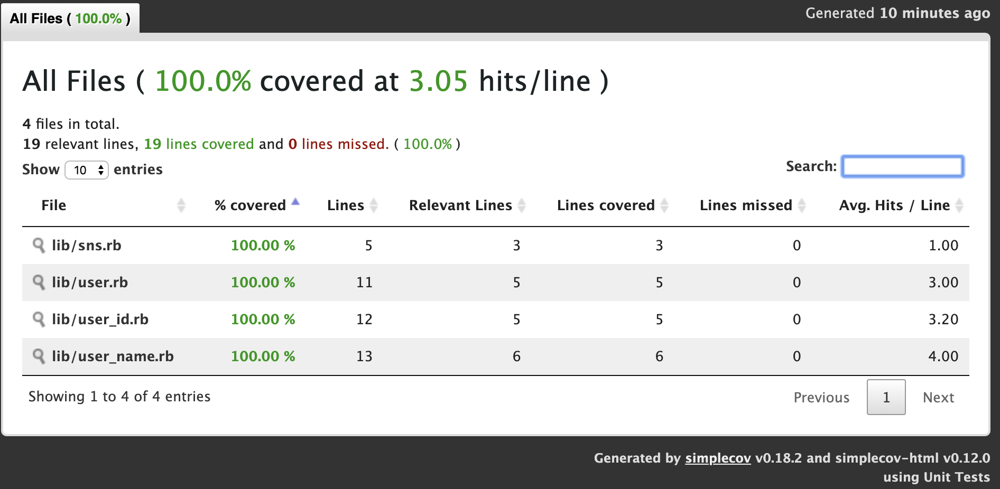

# はじめに

# 値オブジェクト

## ユーザーストーリー

まず **ユーザーストーリー** をもとに仕様を整理します。

> ユーザーストーリーとは、ソフトウェアシステムに求められるふるまいをまとめたものだ。アジャイルソフトウェア開発の世界で広く使われており、大量の機能を細かく分解して計画作りに生かせるようにしている。
> 同じような概念を表す用語としてフィーチャーという言い方もあるが、
> 最近のアジャイル界隈では「ストーリー」とか「ユーザーストーリー」とかいう用語のほうが広まっている。
> 
> —  Martin Fowler's Bliki (ja) <https://bliki-ja.github.io/UserStory> 

SNS(ソーシャルネットワークサービス)のユーザー機能ということなので以下の **ユーザーストーリー** を作成しました。

    利用者として
    ユーザーを管理できるようにしたい
    なぜならユーザーはシステムを利用するために必要だから

## TODOリスト

**ユーザーストーリー** を作成したらそれをもとに **TODOリスト** を作成します。  
**TODOリスト** はプログラムとして実行できる粒度で具体的に記述します。

  - ❏ ユーザーを管理できるようにする
    
      - ❏ ユーザーを登録する
        
          - ❏ IDと名前を持ったユーザーを作成する

## 仮実装

### ユーザーを登録する

さっそく **TODOリスト** の１つ目を片付けましょう。  
まずは **テストファースト** で最初に失敗するコードを書きます。

``` ruby
class HelloTest < Minitest::Test
  def test_greeting
    assert_equal 'hello world', greeting
  end
end

def greeting
  'hello world'
end
```

サンプルコードを以下のコードに書き換えてテストを実行します。

``` ruby
class UserTest < Minitest::Test
  def test_IDと名前を持ったユーザーを作成する
    user = User.new
    assert_equal '1', user.id
    assert_equal 'Bob', user.name
  end
end
```

テストは失敗しました。 `NameError: uninitialized constant UserTest::User` クラスが定義されていないからですね。

``` bash
$ ruby test/hello_test.rb
Started with run options --seed 44125

UserTest
  test_IDと名前を持ったユーザーを作成する                                        ERROR (0.00s)
Minitest::UnexpectedError:         NameError: uninitialized constant UserTest::User
            test/hello_test.rb:7:in test_IDと名前を持ったユーザーを作成する


Finished in 0.00135s
1 tests, 0 assertions, 0 failures, 1 errors, 0 skips
```

テストをパスさせるためにUserクラスを追加します。  
まずはテストをパスさせるために **仮実装** でベタ書きのコードを実装します。

``` ruby
class UserTest < Minitest::Test
  def test_IDと名前を持ったユーザーを作成する
    user = User.new
    assert_equal '1', user.id
    assert_equal 'Bob', user.name
  end
end

class User
  attr_accessor :id, :name

  def initialize
    @id = '1'
    @name = 'Bob'
  end
end
```

テストをパスさせてレッドからグリーンになりました。

``` bash
$ ruby test/hello_test.rb
Started with run options --seed 55832

UserTest
  test_IDと名前を持ったユーザーを作成する                                         PASS (0.00s)

Finished in 0.00072s
1 tests, 2 assertions, 0 failures, 0 errors, 0 skips
```

## 仮実装から実装へ

### ユーザーを登録する

テストは通りましたがコードはベタ書きのままです。

``` ruby
class UserTest < Minitest::Test
  def test_IDと名前を持ったユーザーを作成する
    user = User.new
    assert_equal '1', user.id
    assert_equal 'Bob', user.name
  end
end

class User
  attr_accessor :id, :name

  def initialize
    @id = '1'
    @name = 'Bob'
  end
end
```

**仮実装** のままでは別のユーザーを作ることが出来ないので、コンストラクタ経由で作成できるようにします。

``` ruby
class UserTest < Minitest::Test
  def test_IDと名前を持ったユーザーを作成する
    user = User.new('1', 'Bob')
    assert_equal '1', user.id
    assert_equal 'Bob', user.name
  end
end

class User
  attr_accessor :id, :name

  def initialize(id, name)
    @id = id
    @name = name
  end
end
```

テストが通りました。

``` bash
$ ruby test/hello_test.rb
Started with run options --seed 6402

UserTest
  test_IDと名前を持ったユーザーを作成する                                         PASS (0.00s)

Finished in 0.00089s
1 tests, 2 assertions, 0 failures, 0 errors, 0 skips
```

**仮実装から実装へ** を経て一つ目の **TODOリスト** を片付けたのでここでバージョン管理システムを使ってコミットしておきます。

``` bash
$ git add .
$ git commit -m 'test: ユーザーを登録する'
```

以下、 **TODOリスト** を片付けるたびにコミットしていきます。

## リファクタリング

  - ❏ ユーザーを管理できるようにする
    
      - ❏ ユーザーを登録する
        
          - ✓ IDと名前を持ったユーザーを作成する

レッド・グリーンときたので続いて **リファクタリング** を実施します。

### メソッドの抽出

本来はコードの重複が発生してからやるのですが今回は予め **メソッドの抽出** を適用してフィクスチャーを抽出しておきます。

``` ruby
class UserTest < Minitest::Test
  def test_IDと名前を持ったユーザーを作成する
    user = User.new('1', 'Bob')
    assert_equal '1', user.id
    assert_equal 'Bob', user.name
  end
end
```

Rubyのテスティングフレームワークminitestではフィクスチャーはsetupメソッドです。

``` ruby
class UserTest < Minitest::Test
  def setup
    @user = User.new('1', 'Bob')
  end

  def test_IDと名前を持ったユーザーを作成する
    assert_equal '1', @user.id
    assert_equal 'Bob', @user.name
  end
end
```

テストが壊れていないことを確認したらコミットします。

## 明白な実装

続いて **TODOリスト** を追加します。

  - ❏ ユーザーを管理できるようにする
    
      - ❏ ユーザーを登録する
        
          - ✓ IDと名前を持ったユーザーを作成する
        
          - ❏ **ユーザー名が３文字未満の場合はエラー**

### ユーザーを登録する

追加した **TODOリスト** に取り掛かります。

``` ruby
class UserTest < Minitest::Test
  def setup
    @user = User.new('1', 'Bob')
  end

  def test_IDと名前を持ったユーザーを作成する
    assert_equal '1', @user.id
    assert_equal 'Bob', @user.name
  end
end

class User
  attr_accessor :id, :name

  def initialize(id, name)
    @id = id
    @name = name
  end
end
```

まず、失敗するテストを書いて **明白な実装** でテストをパスするようにします。

``` ruby
class UserTest < Minitest::Test
  def setup
    @user = User.new('1', 'Bob')
  end

  def test_IDと名前を持ったユーザーを作成する
    assert_equal '1', @user.id
    assert_equal 'Bob', @user.name
  end

  def test_ユーザー名が３文字未満の場合はエラー
    e = assert_raises RuntimeError do
      User.new('1', 'a')
    end

    assert_equal 'ユーザー名は3文字以上です。', e.message
  end
end

class User
  attr_accessor :id, :name

  def initialize(id, name)
    raise 'ユーザー名は3文字以上です。' if name.length < 3

    @id = id
    @name = name
  end
end
```

レッドからグリーンになったことを確認したらコミットします。

## リファクタリング

  - ❏ ユーザーを管理できるようにする
    
      - ❏ ユーザーを登録する
        
          - ✓ IDと名前を持ったユーザーを作成する
        
          - ✓ ユーザー名が３文字未満の場合はエラー

レッド・グリーン・リファクタリングです。

### クラスの抽出

**クラスの抽出** を適用して Userクラスから **値オブジェクト** を抽出する **リファクタリング** を適用します。

``` ruby
class UserTest < Minitest::Test
  def setup
    @user = User.new('1', 'Bob')
  end

  def test_IDと名前を持ったユーザーを作成する
    assert_equal '1', @user.id
    assert_equal 'Bob', @user.name
  end

  def test_ユーザー名が３文字未満で新規登録する場合はエラー
    e = assert_raises RuntimeError do
      User.new(1, 'a')
    end

    assert_equal 'ユーザー名は3文字以上です。', e.message
  end
end

class User
  attr_accessor :id, :name

  def initialize(id, name)
    raise 'ユーザー名は3文字以上です。' if name.length < 3

    @id = id
    @name = name
  end
end
```

まずはUserIdクラスを抽出します。テストコードをUserIdクラスを使って呼び出すように変更したらエラーを修正してグリーンの状態を維持します。

``` ruby
class UserTest < Minitest::Test
  def setup
    id = UserId.new('1')
    @user = User.new(id, 'Bob')
  end

  def test_IDと名前を持ったユーザーを作成する
    assert_equal '1', @user.id.value
    assert_equal 'Bob', @user.name
  end
...
end

class UserId
  attr_accessor :value

  def initialize(value)
    @value = value
  end
end

...
```

続いてUserNameクラスを抽出します。テストコードも同様に変更します。

``` ruby
class UserTest < Minitest::Test
  def setup
    id = UserId.new('1')
    name = UserName.new('Bob')
    @user = User.new(id, name)
  end

  def test_IDと名前を持ったユーザーを作成する
    assert_equal '1', @user.id.value
    assert_equal 'Bob', @user.name.value
  end
...
end

...

class UserName
  attr_accessor :value

  def initialize(value)
    raise 'ユーザー名は3文字以上です。' if value.length < 3

    @value = value
  end
end

...
```

テストコードを修正してグリーンになったらコミットして **クラスの抽出** の **リファクタリング** 完了です。

``` bash
$ruby test/hello_test.rb
Started with run options --seed 59746

UserTest
  test_ユーザー名が３文字未満の場合はエラー                                         PASS (0.00s)
  test_IDと名前を持ったユーザーを作成する                                         PASS (0.00s)

Finished in 0.00071s
2 tests, 4 assertions, 0 failures, 0 errors, 0 skips
```

### setメソッドの削除

**クラスの抽出** により **値オブジェクト** を抽出することは出来ましたがインスタンスの値が変更可能な状態です。  
**setメソッドの削除** を適用して **値オブジェクト** の要求を満たす不変オブジェクトに **リファクタリング** しましょう。

``` ruby
class UserTest < Minitest::Test
  def setup
    id = UserId.new('1')
    name = UserName.new('Bob')
    @user = User.new(id, name)
  end

  def test_IDと名前を持ったユーザーを作成する
    assert_equal '1', @user.id.value
    assert_equal 'Bob', @user.name.value
  end

  def test_ユーザー名が３文字未満の場合はエラー
    e = assert_raises RuntimeError do
      UserName.new('a')
    end

    assert_equal 'ユーザー名は3文字以上です。', e.message
  end
end

class UserId
  attr_accessor :value

  def initialize(value)
    @value = value
  end
end

class UserName
  attr_accessor :value

  def initialize(value)
    raise 'ユーザー名は3文字以上です。' if value.length < 3

    @value = value
  end
end

class User
  attr_accessor :id, :name

  def initialize(id, name)
    @id = id
    @name = name
  end
end
```

アックセッサメソッドを読み取り専用に変更します。

``` ruby
...

class UserId
  attr_reader :value

...
end

class UserName
  attr_reader :value

...
end

class User
  attr_reader :id, :name

...
end
```

テストが壊れていないことを確認したらコミットします。

``` bash
$ ruby test/hello_test.rb
Started with run options --seed 62273

UserTest
  test_ユーザー名が３文字未満の場合はエラー                                         PASS (0.00s)
  test_IDと名前を持ったユーザーを作成する                                         PASS (0.00s)

Finished in 0.00075s
2 tests, 4 assertions, 0 failures, 0 errors, 0 skips
```

## 例外ケース

正常系の実装が出来たので続いて例外系の実装に入りたいと思います。  
まず **TODOリスト** を追加します。

  - ❏ ユーザーを管理できるようにする
    
      - ❏ ユーザーを登録する
        
          - ✓ IDと名前を持ったユーザーを作成する
        
          - ✓ ユーザー名が３文字未満の場合はエラー
        
          - ❏ **ユーザー名が４文字の場合は登録される**
        
          - ❏ **ユーザー名を指定しない場合はエラー**
        
          - ❏ **IDを指定しない場合はエラー**

### ユーザーを登録する

追加した **TODOリスト** をテストを壊さないように１つづつ片付けていくとしましょう。

``` ruby
class UserTest < Minitest::Test
  def setup
    id = UserId.new('1')
    name = UserName.new('Bob')
    @user = User.new(id, name)
  end

  def test_IDと名前を持ったユーザーを作成する
    assert_equal '1', @user.id.value
    assert_equal 'Bob', @user.name.value
  end

  def test_ユーザー名が３文字未満の場合はエラー
    e = assert_raises RuntimeError do
      UserName.new('a')
    end

    assert_equal 'ユーザー名は3文字以上です。', e.message
  end
end

class UserId
  attr_reader :value

  def initialize(value)
    @value = value
  end
end

class UserName
  attr_reader :value

  def initialize(value)
    raise 'ユーザー名は3文字以上です。' if value.length < 3

    @value = value
  end
end

class User
  attr_reader :id, :name

  def initialize(id, name)
    @id = id
    @name = name
  end
end
```

実装後のコードです。  
実際は１つテストコードを追加したらプロダクトコードを実装してレッド・グリーンのサイクルを回しています。

``` ruby
class UserTest < Minitest::Test
  def setup
    id = UserId.new('1')
    name = UserName.new('Bob')
    @user = User.new(id, name)
  end

  def test_IDと名前を持ったユーザーを作成する
    assert_equal '1', @user.id.value
    assert_equal 'Bob', @user.name.value
  end

  def test_ユーザー名が３文字未満の場合はエラー
    e = assert_raises RuntimeError do
      UserName.new('a')
    end

    assert_equal 'ユーザー名は3文字以上です。', e.message
  end

  def test_ユーザー名が4文字の場合は登録される
    user = User.new(UserId.new('1'), UserName.new('abcd'))
    assert_equal 'abcd', user.name.value
  end

  def test_ユーザー名を指定しない場合はエラー
    assert_raises RuntimeError do
      UserName.new(nil)
    end
  end

  def test_IDを指定しない場合はエラー
    assert_raises RuntimeError do
      UserId.new(nil)
    end
  end
end

class UserId
  attr_reader :value

  def initialize(value)
    raise if value.nil?

    @value = value
  end
end

class UserName
  attr_reader :value

  def initialize(value)
    raise if value.nil?
    raise 'ユーザー名は3文字以上です。' if value.length < 3

    @value = value
  end
end

class User
  attr_reader :id, :name

  def initialize(id, name)
    @id = id
    @name = name
  end
end
```

例外系の機能を追加してテストもパスしたのでコミットします。

## リファクタリング

  - ❏ ユーザーを管理できるようにする
    
      - ✓ ユーザーを登録する
        
          - ✓ IDと名前を持ったユーザーを作成する
        
          - ✓ ユーザー名が３文字未満の場合はエラー
        
          - ✓ ユーザー名を指定しない場合はエラー
        
          - ✓ ユーザー名が４文字の場合は登録される
        
          - ✓ IDを指定しない場合はエラー

今回はコードの可読性を改善する観点で **リファクタリング** を実施してみたいと思います。

### メソッドのインライン化

テストコードが増えてきましたここでテストコードをグルーピングするため **メソッドのインライン化** を適用します。

``` ruby
class UserTest < Minitest::Test
  def setup
    id = UserId.new('1')
    name = UserName.new('Bob')
    @user = User.new(id, name)
  end

  def test_IDと名前を持ったユーザーを作成する
    assert_equal '1', @user.id.value
    assert_equal 'Bob', @user.name.value
  end

  def test_ユーザー名が３文字未満の場合はエラー
    e = assert_raises RuntimeError do
      UserName.new('a')
    end

    assert_equal 'ユーザー名は3文字以上です。', e.message
  end

  def test_ユーザー名が４文字の場合は登録される
    user = User.new(UserId.new('1'), UserName.new('abcd'))
    assert_equal 'abcd', user.name.value
  end

  def test_ユーザー名を指定しない場合はエラー
    assert_raises RuntimeError do
      UserName.new(nil)
    end
  end

  def test_IDを指定しない場合はエラー
    assert_raises RuntimeError do
      UserId.new(nil)
    end
  end
end

class UserId
  attr_reader :value

  def initialize(value)
    raise if value.nil?

    @value = value
  end
end

class UserName
  attr_reader :value

  def initialize(value)
    raise if value.nil?
    raise 'ユーザー名は3文字以上です。' if value.length < 3

    @value = value
  end
end

class User
  attr_reader :id, :name

  def initialize(id, name)
    @id = id
    @name = name
  end
end
```

テストコードの構造を **TODOリスト** の構造に合わせることで可読性を改善します。

``` ruby
class UserTest < Minitest::Test
  describe 'ユーザーを登録する' do
    def setup
      id = UserId.new('1')
      name = UserName.new('Bob')
      @user = User.new(id, name)
    end

    def test_IDと名前を持ったユーザーを作成する
      assert_equal '1', @user.id.value
      assert_equal 'Bob', @user.name.value
    end

    def test_ユーザー名が３文字未満の場合はエラー
      e = assert_raises RuntimeError do
        UserName.new('a')
      end

      assert_equal 'ユーザー名は3文字以上です。', e.message
    end

    def test_ユーザー名が４文字の場合は登録される
      user = User.new(UserId.new('1'), UserName.new('abcd'))
      assert_equal 'abcd', user.name.value
    end

    def test_ユーザー名を指定しない場合はエラー
      assert_raises RuntimeError do
        UserName.new(nil)
      end
    end

    def test_IDを指定しない場合はエラー
      assert_raises RuntimeError do
        UserId.new(nil)
      end
    end
  end
end

...
```

実行結果もわかりやすいなりました。 テストは壊れていないのでコミットします。

``` bash
$ ruby test/hello_test.rb
Started with run options --seed 39340

ユーザーを登録する
  test_IDと名前を持ったユーザーを作成する                                         PASS (0.00s)
  test_IDを指定しない場合はエラー                                             PASS (0.00s)
  test_ユーザー名が３文字未満の場合はエラー                                         PASS (0.00s)
  test_ユーザー名を指定しない場合はエラー                                          PASS (0.00s)
  test_ユーザー名が４文字の場合は登録される                                         PASS (0.00s)

Finished in 0.00217s
5 tests, 7 assertions, 0 failures, 0 errors, 0 skips
```

### キーワード引数の導入

テストコードは読みやすくなりました。続いてプロダクトコードを改善しましょう。  
動的言語であるRubyでは型を明示しないため引数の値がリテラルなのか **値オブジェクト** なのかメソッドの定義だけでは把握できません。**キーワード引数の導入** をしてできるだけ引数の型を把握しやすいように **リファクタリング** しましょう。

``` ruby
class UserTest < Minitest::Test
  describe 'ユーザーを登録する' do
    def setup
      id = UserId.new('1')
      name = UserName.new('Bob')
      @user = User.new(id, name)
    end

    def test_IDと名前を持ったユーザーを作成する
      assert_equal '1', @user.id.value
      assert_equal 'Bob', @user.name.value
    end

    def test_ユーザー名が３文字未満の場合はエラー
      e = assert_raises RuntimeError do
        UserName.new('a')
      end

      assert_equal 'ユーザー名は3文字以上です。', e.message
    end

    def test_ユーザー名が４文字の場合は登録される
      user = User.new(UserId.new('1'), UserName.new('abcd'))
      assert_equal 'abcd', user.name.value
    end

    def test_ユーザー名を指定しない場合はエラー
      assert_raises RuntimeError do
        UserName.new(nil)
      end
    end

    def test_IDを指定しない場合はエラー
      assert_raises RuntimeError do
        UserId.new(nil)
      end
    end
  end
end

class UserId
  attr_reader :value

  def initialize(value)
    raise if value.nil?

    @value = value
  end
end

class UserName
  attr_reader :value

  def initialize(value)
    raise if value.nil?
    raise 'ユーザー名は3文字以上です。' if value.length < 3

    @value = value
  end
end

class User
  attr_reader :id, :name

  def initialize(id, name)
    @id = id
    @name = name
  end
end
```

**キーワード引数** を **値オブジェクト** と同じ名称にします。

``` ruby
class UserTest < Minitest::Test
  describe 'ユーザーを登録する' do
    def setup
      id = UserId.new('1')
      name = UserName.new('Bob')
      @user = User.new(user_id: id, user_name: name)
    end
...
end

...

class User
  attr_reader :id, :name

  def initialize(user_id:, user_name:)
    @id = user_id
    @name = user_name
  end
end
```

テストを修正してグリーンになったらコミットします。  
ちなみに **キーワード引数の導入** という名称はリファクタリングのカタログにはない用語です。Ruby固有のパターンとして便宜上命名しています。

## モジュール分割

**TODOリスト** を全部片付けたのでここで単一ファイルから各クラスモジュールごとに **モジュール分割** を実施します。

### TODOリスト

  - ❏ ユーザーを管理できるようにする
    
      - ✓ ユーザーを登録する
        
          - ✓ IDと名前を持ったユーザーを作成する
        
          - ✓ ユーザー名が３文字未満の場合はエラー
        
          - ✓ ユーザー名を指定しない場合はエラー
        
          - ✓ ユーザー名が４文字の場合は登録される
        
          - ✓ IDを指定しない場合はエラー

### クラス図

    class User {
      UserId id
      UserName name
    }
    class UserId {
      String value
    }
    class UserName {
      String value
    }
    
    User *-l UserId
    User *-r UserName

### ファイル構成

    /main.rb
      |--lib/
          |
           -- sns.rb
           -- user_id.rb
           -- user_name.rb
           -- user.rb
      |--test/
          |
           -- user_test.rb

**/main.rb.**

``` ruby
require './test/user_test.rb'
```

**/lib/sns.rb.**

``` ruby
# frozen_string_literal: true

require './lib/user_id.rb'
require './lib/user_name.rb'
require './lib/user.rb'
```

**/lib/user\_id.rb.**

``` ruby
# frozen_string_literal: true

# User ID value object
class UserId
  attr_reader :value

  def initialize(value)
    raise if value.nil?

    @value = value
  end
end
```

**/lib/user\_name.rb.**

``` ruby
# frozen_string_literal: true

# User name value object
class UserName
  attr_reader :value

  def initialize(value)
    raise if value.nil?
    raise 'ユーザー名は3文字以上です。' if value.length < 3

    @value = value
  end
end
```

**/lib/user.rb.**

``` ruby
# frozen_string_literal: true

# User
class User
  attr_reader :id, :name

  def initialize(user_id:, user_name:)
    @id = user_id
    @name = user_name
  end
end
```

**/test/user\_test.rb.**

``` ruby
# frozen_string_literal: true

require 'minitest/reporters'
Minitest::Reporters.use! [Minitest::Reporters::SpecReporter.new(color: true)]
require 'minitest/autorun'
require './lib/sns.rb'

class UserTest < Minitest::Test
  describe 'ユーザーを登録する' do
    def setup
      id = UserId.new('1')
      name = UserName.new('Bob')
      @user = User.new(user_id: id, user_name: name)
    end

    def test_IDと名前を持ったユーザーを作成する
      assert_equal '1', @user.id.value
      assert_equal 'Bob', @user.name.value
    end

    def test_ユーザー名が３文字未満の場合はエラー
      e = assert_raises RuntimeError do
        UserName.new('a')
      end

      assert_equal 'ユーザー名は3文字以上です。', e.message
    end

    def test_ユーザー名が４文字の場合は登録される
      user = User.new(user_id: UserId.new('1'),
                      user_name: UserName.new('abcd'))
      assert_equal 'abcd', user.name.value
    end

    def test_ユーザー名を指定しない場合はエラー
      assert_raises RuntimeError do
        UserName.new(nil)
      end
    end

    def test_IDを指定しない場合はエラー
      assert_raises RuntimeError do
        UserId.new(nil)
      end
    end
  end
end
```

## リリース

**モジュール分割** により最初のリリースの準備が出来ました。  
リリース前に **静的コード解析** と **コードカバレッジ** を実施してコードの品質を確認しておきましょう。  
手順の詳細は [こちらの記事](https://qiita.com/k2works/items/385dc16333e065d69bd6) をご参照ください。

### 静的コード解析

``` bash
$ rubocop
Inspecting 5 files
....C

Offenses:

test/user_test.rb:11:3: C: Metrics/BlockLength: Block has too many lines. [30/25]
  describe 'ユーザーを登録する' do ...
  ^^^^^^^^^^^^^^^^^^^^^^^
test/user_test.rb:18:9: C: Naming/MethodName: Use snake_case for method names.
    def test_IDと名前を持ったユーザーを作成する
        ^^^^^^^^^^^^^^^^^^^^^^^
test/user_test.rb:18:16: C: Naming/AsciiIdentifiers: Use only ascii symbols in identifiers.
    def test_IDと名前を持ったユーザーを作成する
               ^^^^^^^^^^^^^^^^
test/user_test.rb:23:9: C: Naming/MethodName: Use snake_case for method names.
    def test_ユーザー名が３文字未満の場合はエラー
        ^^^^^^^^^^^^^^^^^^^^^^^
test/user_test.rb:23:14: C: Naming/AsciiIdentifiers: Use only ascii symbols in identifiers.
    def test_ユーザー名が３文字未満の場合はエラー
             ^^^^^^^^^^^^^^^^^^
test/user_test.rb:31:9: C: Naming/MethodName: Use snake_case for method names.
    def test_ユーザー名が４文字の場合は登録される
        ^^^^^^^^^^^^^^^^^^^^^^^
test/user_test.rb:31:14: C: Naming/AsciiIdentifiers: Use only ascii symbols in identifiers.
    def test_ユーザー名が４文字の場合は登録される
             ^^^^^^^^^^^^^^^^^^
test/user_test.rb:37:9: C: Naming/MethodName: Use snake_case for method names.
    def test_ユーザー名を指定しない場合はエラー
        ^^^^^^^^^^^^^^^^^^^^^^
test/user_test.rb:37:14: C: Naming/AsciiIdentifiers: Use only ascii symbols in identifiers.
    def test_ユーザー名を指定しない場合はエラー
             ^^^^^^^^^^^^^^^^^
test/user_test.rb:43:9: C: Naming/MethodName: Use snake_case for method names.
    def test_IDを指定しない場合はエラー
        ^^^^^^^^^^^^^^^^^^^
test/user_test.rb:43:16: C: Naming/AsciiIdentifiers: Use only ascii symbols in identifiers.
    def test_IDを指定しない場合はエラー
               ^^^^^^^^^^^^

5 files inspected, 11 offenses detected
```

いくつか警告が表示されていますがテストコードの日本語に関する内容なのでチェック対象から除外することにします。 

`.rubocop.yml` ファイルを以下に更新します。

``` yml
inherit_from: .rubocop_todo.yml

AllCops:
    Include:
      - 'lib/**/*.rb'
      - 'test/**/*_test.rb'
    Exclude:
      - 'docs'

Style/AsciiComments:
  Enabled: false

Naming/MethodName:
  Exclude:
    - 'test/**'

Naming/AsciiIdentifiers:
  Exclude:
    - 'test/**'

Metrics/BlockLength:
  Exclude:
    - 'test/**'
```

警告は無くなりました。

``` bash
$ rubocop
Inspecting 5 files
.....

5 files inspected, no offenses detected
```

### コードカバレッジ

まず、テストコードからコードカバレッジを実行できるようにします。

`user_test.rb` の先頭を以下に更新します。

``` ruby
# frozen_string_literal: true

require 'simplecov'
SimpleCov.start
require 'minitest/reporters'
Minitest::Reporters.use! [Minitest::Reporters::SpecReporter.new(color: true)]
require 'minitest/autorun'
require './lib/sns.rb'

...
```

テストを実行します。

``` bash
$ ruby test/user_test.rb
Started with run options --seed 24571

ユーザーを登録する
  test_IDを指定しない場合はエラー                                             PASS (0.00s)
  test_ユーザー名が４文字の場合は登録される                                         PASS (0.00s)
  test_ユーザー名を指定しない場合はエラー                                          PASS (0.00s)
  test_ユーザー名が３文字未満の場合はエラー                                         PASS (0.00s)
  test_IDと名前を持ったユーザーを作成する                                         PASS (0.00s)

Finished in 0.00106s
5 tests, 7 assertions, 0 failures, 0 errors, 0 skips
Coverage report generated for Unit Tests to /Users/k2works/Projects/sandbox/tdd_itddd/coverage. 19 / 19 LOC (100.0%) covered.
```

テストカバレッジは100%です。



## ふりかえり

最初のリリースが完了したのでここでやってきたことのふりかえりをしておきましょう。

まず、**ユーザーストーリー** から **TODOリスト** を作成しました。  
**TODOリスト** の１つめを **仮実装** でまずベタ書きのコードを書いてテストをパスするようにしました。  
テストをパスしてグリーンになったら **仮実装から実装へ** を経て最初の **TODOリスト** を完了させました。

次の **TODOリスト** を追加する前にテストコードに **メソッドの抽出** を適用して **リファクタリング** を実施しました。  
**リファクタリング** を実施してテストが壊れていないことを確認してから **TODOリスト** を追加して次の作業に入りました。  
次の作業ではまず **TODOリスト** を追加してその内容を **明白な実装** で片付けました。

**明白な実装** により再びテストがレッドからグリーンになったので **クラスの抽出** と **setメソッドの削除** を適用して
**リファクタリング** を実施することにより **値オブジェクト** を追加しました。  
**リファクタリング** を実施してテストが壊れていないことを確認したら 次は例外ケースの **TODOリスト** を追加しました。

追加した例外ケースを **明白な実装** で片付けたら、まずテストコードに **メソッドのインライン化** を適用して プロダクトコードに
**キーワード引数の導入** を適用してコードの可読性を改善する **リファクタリング** を実施しました。

仕上げに **モジュール分割** を実施しました。  
続いて **静的コード** と **コードカバレッジ** を実施してコードの品質を確認して、最初のリリースを完了しました。

今回のテーマである **値オブジェクト** は書籍『テスト駆動開発』では *第１部 他国通貨* の中でMoneyクラスとして実装されていますし **Value Objectパターン** として紹介されています。

> Value Objectパターン
> 
> 広く共有されるものの、同一インスタンスであることはさほど重要でないオブジェクトを設計するにはどうしたらよいだろうか-----オブジェクト作成時に状態を設定したら、その後決して変えないようにする。オブジェクトへの操作は必ず新しいオブジェクトを返すようにしよう。
> 
> —  テスト駆動開発 

また、書籍『リファクタリング』では *第３章　コードの不吉な臭い* の中の **基本データ型への執着** で言及されています。

> 基本データ型への執着
> 
> オブジェクト指向を始めたばかりの人は、小さなオブジェクトを使ってちょっとしたことをさせるのを嫌がる傾向があります。金額と通貨単位を組み合わせたMoney(貨幣)クラス、上限と下限と持つRange(範囲)クラス、電話番号や郵便番号を表すための特殊な文字列クラスなどがこの例に該当します。
> 
> —  新装版 リファクタリング 

アプリケーション開発の過程でどのように **値オブジェクト** を適用するかは [こちらの記事](https://qiita.com/k2works/items/928d519a7afe99361ff2#%E5%80%A4%E3%82%AA%E3%83%96%E3%82%B8%E3%82%A7%E3%82%AF%E3%83%88)をご参照ください。

今回のリリースでユーザーは登録することは出来ましたがユーザー名を変更することが出来ません。

次回は **エンティティ** の実装に取り組んでみたいと思います。

# エンティティ

# ドメインサービス

# リポジトリ

# アプリケーションサービス

# 依存関係のコントロール

# ソフトウェアシステムを組み立てる

# ファクトリ

# データの整合性

# アプリケーションを1から組み立てる

# 集約

# 仕様

# アーキテクチャ

# 参照

## 参考サイト

  - [50
    分でわかるテスト駆動開発](https://channel9.msdn.com/Events/de-code/2017/DO03?ocid=player)

## 参考図書

# References

  - \[\] テスト駆動開発 Kent Beck (著), 和田 卓人 (翻訳): オーム社; 新訳版 (2017/10/14)

  - \[\] 新装版 リファクタリング―既存のコードを安全に改善する― (OBJECT TECHNOLOGY SERIES) Martin
    Fowler (著), 児玉 公信 (翻訳), 友野 晶夫 (翻訳), 平澤 章 (翻訳), その他: オーム社; 新装版
    (2014/7/26)

  - \[\] リファクタリング(第2版): 既存のコードを安全に改善する (OBJECT TECHNOLOGY SERIES) Martin
    Fowler (著), 児玉 公信 (翻訳), 友野 晶夫 (翻訳), 平澤 章 (翻訳), その他: オーム社; 第2版
    (2019/12/1)

  - \[\] ドメイン駆動設計入門 ボトムアップでわかる\! ドメイン駆動設計の基本 (日本語) 単行本（ソフトカバー） 成瀬 允宣 (著)
    翔泳社 (2020/2/13)
